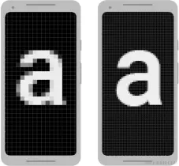

## 方案概述

本文基于 density 修改的屏幕适配方案，通过修改系统的 `density` 值来实现不同尺寸设备上的 UI 等比例缩放。

可以实现下面的效果



### 核心优势

- **代码简洁**：仅 237 行代码，逻辑清晰
- **兼容性好**：适用于所有 Android 设备和模拟器
- **零侵入性**：布局使用标准的 dp/sp 单位，无需修改现有代码
- **性能优秀**：缓存机制 + 反射优化，几乎无性能损耗
- **使用简单**：一行代码即可完成适配

---

## 工作原理

### Android 的 dp 单位

Android 中，dp（density-independent pixel，密度无关像素）到像素的转换公式：

```
像素 px = dp 值 × density
```

例如，在一个 `density = 3.0` 的设备上：
- `100dp` = `100 × 3.0` = `300px`

### 适配原理

通过修改 `density` 值，让不同设备的"1dp"代表不同的像素数，从而实现等比例缩放。

**适配公式：**
```
新 density = 设备屏幕宽度(px) ÷ 设计稿宽度(dp)
```

**示例：**

假设设计稿宽度为 `360dp`：

| 设备 | 屏幕宽度 | 计算公式 | 新 density | 结果 |
|------|---------|---------|-----------|------|
| 手机A | 1080px | 1080 ÷ 360 | 3.0 | 1dp = 3px |
| 手机B | 720px  | 720 ÷ 360  | 2.0 | 1dp = 2px |
| 手机C | 1440px | 1440 ÷ 360 | 4.0 | 1dp = 4px |

这样，设计稿中的 `360dp` 宽度，在所有设备上都会占满整个屏幕宽度。

---

## 快速开始

### 1. 在 Activity 中启用适配

在 Activity 的 `getResources()` 方法中调用：

```java
@Override
public Resources getResources() {
    Resources resources = super.getResources();
    // 360 是你的设计稿宽度(dp)
    return AdaptScreenUtils.adaptWidth(resources, 360);
}
```

### 2. 在 BaseActivity 中全局启用

如果你有基类 Activity，推荐在基类中统一处理：

```java
public abstract class BaseActivity extends AppCompatActivity {
    @Override
    public Resources getResources() {
        Resources resources = super.getResources();
        return AdaptScreenUtils.adaptWidth(resources, 360);
    }
}
```

之后所有继承 `BaseActivity` 的 Activity 都会自动适配。

### 3. 编写布局文件

正常使用 `dp` 和 `sp` 单位即可：

```xml
<TextView
    android:layout_width="100dp"
    android:layout_height="50dp"
    android:textSize="16sp"
    android:padding="12dp" />
```

**就这么简单！**

---

## API 文档

### 方法列表

#### 1. adaptWidth() - 按宽度适配

```java
AdaptScreenUtils.adaptWidth(Resources resources, int designWidth)
```

**参数：**
- `resources`：Activity 的 Resources 对象
- `designWidth`：设计稿宽度，单位 dp（例如：360）

**返回：**
- 适配后的 Resources 对象

**适用场景：**
- 大部分应用（推荐）
- 横屏应用
- 以宽度为基准的适配需求

---

#### 2. adaptHeight() - 按高度适配

```java
// 方式1：不包含导航栏
AdaptScreenUtils.adaptHeight(Resources resources, int designHeight)

// 方式2：包含导航栏高度
AdaptScreenUtils.adaptHeight(Resources resources, int designHeight, boolean includeNavBar)
```

**参数：**
- `resources`：Activity 的 Resources 对象
- `designHeight`：设计稿高度，单位 dp（例如：640）
- `includeNavBar`：是否将导航栏高度计入计算

**适用场景：**
- 竖屏游戏
- 以高度为基准的适配需求
- 需要固定高度比例的界面

---

#### 3. closeAdapt() - 关闭适配

```java
AdaptScreenUtils.closeAdapt(Resources resources)
```

恢复系统默认的 density 值。

**适用场景：**
- 某些特殊页面需要使用系统默认显示
- 第三方 SDK 页面
- WebView 页面

---

#### 4. dp2Px() / px2Dp() - 单位转换

```java
// dp 转 px
int px = AdaptScreenUtils.dp2Px(resources, 100f);

// px 转 dp
int dp = AdaptScreenUtils.px2Dp(resources, 300f);
```

代码中动态计算尺寸时使用。

---

## 使用建议

### 1. 设计稿宽度的选择

| 设计稿宽度 | 适用场景 | 说明 |
|-----------|---------|------|
| 360dp | **推荐** | Android 主流手机宽度 |
| 375dp | iOS 适配 | 对应 iPhone 标准宽度 |
| 414dp | 大屏手机 | 对应 iPhone Plus 宽度 |

**建议使用 360dp**，这是 Android 最常见的基准宽度。

### 2. 布局单位使用规范

| 属性类型 | 推荐单位 | 说明 |
|---------|---------|------|
| 宽度/高度 | `dp` | 固定尺寸 |
| 内外边距 | `dp` | 固定间距 |
| 正文字体 | `sp` | 跟随系统字体缩放 |
| 标题/装饰字体 | `dp` | 固定大小，不跟随系统缩放 |

**示例：**
```xml
<TextView
    android:layout_width="match_parent"
    android:layout_height="48dp"
    android:textSize="16sp"
    android:paddingHorizontal="16dp" />
```

### 3. 特殊情况处理

**情况1：某个页面不需要适配**

```java
public class SpecialActivity extends AppCompatActivity {
    @Override
    public Resources getResources() {
        Resources resources = super.getResources();
        // 关闭适配
        return AdaptScreenUtils.closeAdapt(resources);
    }
}
```

**情况2：使用第三方 UI 库时**

如果第三方库的 UI 显示异常，可以尝试在该页面关闭适配，或调整适配参数。

**情况3：WebView 页面**

WebView 内部有自己的适配逻辑，建议关闭适配：

```java
public class WebActivity extends AppCompatActivity {
    @Override
    public Resources getResources() {
        return AdaptScreenUtils.closeAdapt(super.getResources());
    }
}
```

---

## 性能优化说明

### 缓存机制

工具类内部实现了缓存机制：
- 缓存计算后的 density 值
- 100ms 内相同的 density 不重复应用
- 避免频繁修改带来的性能开销

### 反射优化

- 首次调用时通过反射查找所有 DisplayMetrics 字段
- 缓存反射结果，后续调用直接使用
- 确保 density 修改应用到 Resources 的所有实例

---

## 调试与日志

开启调试日志可以查看适配详情：

```
D/AdaptScreenUtils: Adapting screen - Width: 1080px, Design width: 360dp, Original density: 3.0, Target density: 3.0, Target densityDpi: 480
```

**日志说明：**
- `Width`：设备屏幕宽度（像素）
- `Design width`：设计稿宽度（dp）
- `Original density`：系统原始 density
- `Target density`：计算后的目标 density
- `Target densityDpi`：对应的 densityDpi 值

---

## 常见问题

### Q1: 为什么文字大小使用 sp 而不是 dp？

**A:** `sp` 单位会跟随用户的系统字体大小设置进行缩放，提升可访问性。正文使用 `sp`，装饰性文字可以使用 `dp`。

### Q2: 适配后图片资源会变模糊吗？

**A:** 不会。Android 系统会根据 `densityDpi` 自动选择合适的图片资源（hdpi、xhdpi、xxhdpi 等）。建议提供多套图片资源以获得最佳显示效果。

### Q3: 平板设备需要单独适配吗？

**A:** 看需求。如果希望平板显示更多内容，可以在平板上使用更大的设计稿宽度（如 600dp）；如果希望和手机等比例放大，使用相同的设计稿宽度即可。

### Q4: 横竖屏切换会有问题吗？

**A:** 不会。每次调用 `getResources()` 时都会重新计算 density，横竖屏切换会自动重新适配。

### Q5: 适配方案会影响第三方库吗？

**A:** 极少数情况下可能有影响。如果遇到第三方库显示异常，可以在该页面单独关闭适配。

---

## 实际效果演示

### 设计稿：360dp × 640dp

**手机A（1080×1920）：**
```
density = 1080 / 360 = 3.0
设计稿中的 100dp 按钮 → 实际显示 300px
```

**手机B（720×1280）：**
```
density = 720 / 360 = 2.0
设计稿中的 100dp 按钮 → 实际显示 200px
```

**手机C（1440×2560）：**
```
density = 1440 / 360 = 4.0
设计稿中的 100dp 按钮 → 实际显示 400px
```

虽然实际像素不同，但按钮在三台设备上**占屏幕宽度的比例完全一致**，视觉效果相同。

---

## 技术细节

### 核心实现

```java
// 计算目标 density
float targetDensity = dm.widthPixels / (float) designWidth;
float targetScaledDensity = targetDensity * (dm.scaledDensity / dm.density);
int targetDensityDpi = (int) (targetDensity * 160);

// 应用到 DisplayMetrics
dm.density = targetDensity;
dm.scaledDensity = targetScaledDensity;
dm.densityDpi = targetDensityDpi;

// 通过反射应用到所有 DisplayMetrics 实例
applyOtherDisplayMetrics(resources, targetDensity, targetScaledDensity, targetDensityDpi);
```

### densityDpi 的作用

`densityDpi` 用于图片资源的选择：
- `densityDpi = 160`：mdpi（1x）
- `densityDpi = 240`：hdpi（1.5x）
- `densityDpi = 320`：xhdpi（2x）
- `densityDpi = 480`：xxhdpi（3x）
- `densityDpi = 640`：xxxhdpi（4x）

---

## 源码信息

**代码统计：**
- 总行数：237 行
- 公开方法：7 个
- 私有方法：3 个
- 无外部依赖

**方法列表：**
- `adaptWidth(Resources, int)` - 宽度适配
- `adaptHeight(Resources, int)` - 高度适配
- `adaptHeight(Resources, int, boolean)` - 高度适配（含导航栏选项）
- `closeAdapt(Resources)` - 关闭适配
- `dp2Px(Resources, float)` - dp 转 px
- `px2Dp(Resources, float)` - px 转 dp
- `getNavBarHeight(Resources)` - 获取导航栏高度（私有）
- `applyOtherDisplayMetrics(...)` - 应用到所有 DisplayMetrics（私有）
- `getMetricsFromField(...)` - 反射获取字段（私有）

---


AdaptScreenUtils 代码

```
import android.content.res.Resources;
import android.util.DisplayMetrics;
import android.util.Log;

import java.lang.reflect.Field;
import java.util.ArrayList;
import java.util.List;

/**
 * 屏幕适配工具类 - 基于 dp 单位的适配方案
 * 通过修改 DisplayMetrics.density 值来改变 dp 单位的换算比例
 *
 * 原理：dp to px 的换算公式为 px = dp × density
 * 通过设置 density = 屏幕宽度px / 设计稿宽度dp，使得设计稿在不同设备上保持相同的视觉比例
 */
public final class AdaptScreenUtils {
    private static final String TAG = "AdaptScreenUtils";
    private static List<Field> sMetricsFields;

    // 缓存已应用的 density 值，避免频繁修改
    private static float sCurrentDensity = -1;
    private static long sLastApplyTime = 0;
    private static final long APPLY_INTERVAL = 100; // 100ms内不重复应用

    private AdaptScreenUtils() {
        throw new UnsupportedOperationException("Cannot instantiate AdaptScreenUtils");
    }

    /**
     * 根据设计稿宽度进行适配（适用于横屏或以宽度为基准的适配）
     * 在 Activity 的 getResources() 方法中调用
     *
     * @param resources   资源对象
     * @param designWidth 设计稿宽度（单位：dp）
     * @return 适配后的 Resources
     */
    public static Resources adaptWidth(final Resources resources, final int designWidth) {
        DisplayMetrics dm = resources.getDisplayMetrics();

        // 计算目标 density
        // 公式: density = 屏幕实际宽度(px) / 设计稿宽度(dp)
        float targetDensity = dm.widthPixels / (float) designWidth;
        float targetScaledDensity = targetDensity * (dm.scaledDensity / dm.density);
        int targetDensityDpi = (int) (targetDensity * 160);

        // 缓存机制：如果 density 已经是目标值，且在时间间隔内，直接返回，避免频繁修改
        long currentTime = System.currentTimeMillis();
        if (Math.abs(sCurrentDensity - targetDensity) < 0.01f &&
            (currentTime - sLastApplyTime) < APPLY_INTERVAL) {
            return resources;
        }

        // 打印调试信息（仅在实际应用时打印）
        Log.d(TAG, "Adapting screen - Width: " + dm.widthPixels + "px" +
                ", Design width: " + designWidth + "dp" +
                ", Original density: " + dm.density +
                ", Target density: " + targetDensity +
                ", Target densityDpi: " + targetDensityDpi);

        // 应用新的 density 值
        dm.density = targetDensity;
        dm.scaledDensity = targetScaledDensity;
        dm.densityDpi = targetDensityDpi;

        // 应用到所有 DisplayMetrics 字段
        applyOtherDisplayMetrics(resources, targetDensity, targetScaledDensity, targetDensityDpi);

        // 更新缓存
        sCurrentDensity = targetDensity;
        sLastApplyTime = currentTime;

        return resources;
    }

    /**
     * 根据设计稿高度进行适配（适用于竖屏或以高度为基准的适配）
     * 在 Activity 的 getResources() 方法中调用
     *
     * @param resources    资源对象
     * @param designHeight 设计稿高度（单位：dp）
     * @return 适配后的 Resources
     */
    public static Resources adaptHeight(final Resources resources, final int designHeight) {
        return adaptHeight(resources, designHeight, false);
    }

    /**
     * 根据设计稿高度进行适配（适用于竖屏或以高度为基准的适配）
     * 在 Activity 的 getResources() 方法中调用
     *
     * @param resources     资源对象
     * @param designHeight  设计稿高度（单位：dp）
     * @param includeNavBar 是否包含导航栏高度
     * @return 适配后的 Resources
     */
    public static Resources adaptHeight(final Resources resources, final int designHeight,
            final boolean includeNavBar) {
        DisplayMetrics dm = resources.getDisplayMetrics();

        int screenHeight = dm.heightPixels + (includeNavBar ? getNavBarHeight(resources) : 0);

        // 计算目标 density
        // 公式: density = 屏幕实际高度(px) / 设计稿高度(dp)
        float targetDensity = screenHeight / (float) designHeight;
        float targetScaledDensity = targetDensity * (dm.scaledDensity / dm.density);
        int targetDensityDpi = (int) (targetDensity * 160);

        // 应用新的 density 值
        dm.density = targetDensity;
        dm.scaledDensity = targetScaledDensity;
        dm.densityDpi = targetDensityDpi;

        // 应用到所有 DisplayMetrics 字段
        applyOtherDisplayMetrics(resources, targetDensity, targetScaledDensity, targetDensityDpi);

        return resources;
    }

    /**
     * 获取导航栏高度
     */
    private static int getNavBarHeight(final Resources resources) {
        int resourceId = resources.getIdentifier("navigation_bar_height", "dimen", "android");
        if (resourceId != 0) {
            return resources.getDimensionPixelSize(resourceId);
        } else {
            return 0;
        }
    }

    /**
     * 关闭适配，恢复默认值
     *
     * @param resources 资源对象
     * @return 恢复后的 Resources
     */
    public static Resources closeAdapt(final Resources resources) {
        DisplayMetrics systemDm = Resources.getSystem().getDisplayMetrics();
        DisplayMetrics appDm = resources.getDisplayMetrics();

        // 恢复为系统默认的 density 值
        appDm.density = systemDm.density;
        appDm.scaledDensity = systemDm.scaledDensity;
        appDm.densityDpi = systemDm.densityDpi;

        applyOtherDisplayMetrics(resources, systemDm.density, systemDm.scaledDensity, systemDm.densityDpi);

        return resources;
    }

    /**
     * dp 值转 px 值
     *
     * @param dpValue dp 值
     * @return px 值
     */
    public static int dp2Px(final Resources resources, final float dpValue) {
        DisplayMetrics metrics = resources.getDisplayMetrics();
        return (int) (dpValue * metrics.density + 0.5);
    }

    /**
     * px 值转 dp 值
     *
     * @param pxValue px 值
     * @return dp 值
     */
    public static int px2Dp(final Resources resources, final float pxValue) {
        DisplayMetrics metrics = resources.getDisplayMetrics();
        return (int) (pxValue / metrics.density + 0.5);
    }

    /**
     * 应用 density 到所有相关的 DisplayMetrics 对象
     * 通过反射找到 Resources 中的所有 DisplayMetrics 字段并更新
     */
    private static void applyOtherDisplayMetrics(final Resources resources,
                                                 final float targetDensity,
                                                 final float targetScaledDensity,
                                                 final int targetDensityDpi) {
        if (sMetricsFields == null) {
            sMetricsFields = new ArrayList<>();
            Class<?> resCls = resources.getClass();
            Field[] declaredFields = resCls.getDeclaredFields();

            while (declaredFields != null && declaredFields.length > 0) {
                for (Field field : declaredFields) {
                    if (field.getType().isAssignableFrom(DisplayMetrics.class)) {
                        field.setAccessible(true);
                        DisplayMetrics tmpDm = getMetricsFromField(resources, field);
                        if (tmpDm != null) {
                            sMetricsFields.add(field);
                            tmpDm.density = targetDensity;
                            tmpDm.scaledDensity = targetScaledDensity;
                            tmpDm.densityDpi = targetDensityDpi;
                        }
                    }
                }

                resCls = resCls.getSuperclass();
                if (resCls != null) {
                    declaredFields = resCls.getDeclaredFields();
                } else {
                    break;
                }
            }
        } else {
            // 应用到已缓存的字段
            for (Field metricsField : sMetricsFields) {
                try {
                    DisplayMetrics dm = (DisplayMetrics) metricsField.get(resources);
                    if (dm != null) {
                        dm.density = targetDensity;
                        dm.scaledDensity = targetScaledDensity;
                        dm.densityDpi = targetDensityDpi;
                    }
                } catch (Exception e) {
                    Log.e(TAG, "applyOtherDisplayMetrics: " + e);
                }
            }
        }
    }

    /**
     * 从字段中获取 DisplayMetrics 对象
     */
    private static DisplayMetrics getMetricsFromField(final Resources resources, final Field field) {
        try {
            return (DisplayMetrics) field.get(resources);
        } catch (Exception e) {
            Log.e(TAG, "getMetricsFromField: " + e);
            return null;
        }
    }
}

```
